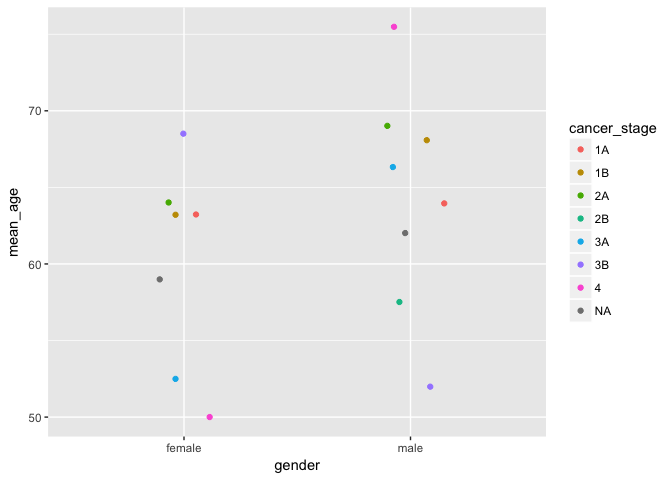
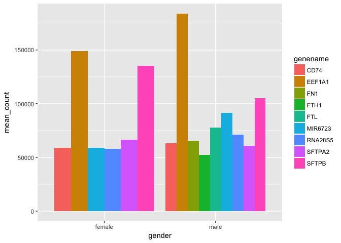

Analysis Report 2: Your Title Here
================
Chelsea Noack
November 10, 2017

Introduction
============

Smoking is a prevalent habit with dire consequences. Evidence of smoking's effects became evident beginning as early as the 1930's. Since then, it is common knowledge. Not all lung cancers are the same. For example, non small cell lung adenocarcinoma (NSCLC) accounts for 85% of lung cancers. Of those who have NSCLC, only about 15% survive five years post-diagnosis (Ettinger *et al.*, 2010). Thus, not only does lung cancer clearly have a deadly consequence, but it is the most fatal cancer

But one component of lung cancer still leaves us worried. While the cancer is preventable by not having a tobacco habit, there is still a genetic component. In other words, even those who have never smoked can still get non small cell lung adenocarcinoma. Of the known carcinogens in cigarettes, they convert to reactive metabolites. If not inactivated, they can bind to cellular DNA and form adducts, a product of added molecules to create a distinct molecular species (Zienolddiny *et al.*, 2005). The large adducts which form typically get repaired, however researchers find that lung cancer patients have low DNA repair capacity. Zienolddiny et al. state that "variant DNA repair genotypes may alter susceptibility to lung cancer", indicating a genetic component within the repair mechanism, making certain persons more susceptible to lung cancer despite smoking or not smoking (2005).

Thus, if smoking is not only caused by habits, but there is also a genetic component, it leads me to wonder if females and males differ in this genetic component? Can sex be a factor when it comes to the genetic quality of DNA repair mechanisms and thus carry on genes influencing the progression of lung cancer? In addition, will the age of certain females and males be a factor in terms of which stage of lung cancer they get diagnosed? For example, is it primarily younger non-smoker females/males with severe cases of lung cancer, or, more predictably, is it those whom are younger, non-smokers whom have stage 1?

These questions must take into account the anthropological effects of habits/genetics on females and males. In some countries, smoking is looked down upon more than others. Also in some countries, women and men are expected to have different habits. Thus, in order to answer these questions I will have to look at data from one area. In this case, studies done on Korean patients will be used in order to answer our questions. Korea is known for many prevalent cancers which are not pertained to the lunch, such as stomach, colon/rectal, and thyroid among both sexes. However, lung cancer is still the most deadly, accounting for 15,623 deaths in 2010 (Jung *et al.*, 2013). With this known, I will use data from the Seo et al. and Li et al. studies in order to better answer these questions connecting sex to the genetic components of lung cancer and its severity for non-smokers.

I hypothesize that those whom are younger non-smokers will have lower cancer stages than those who are older smokers. In addition, I argue that females will have a higher genetic component than men (indicating cancer from non-smoking rather than smoking) given the cultural context.

Methods
=======

Sample origin and sequencing
----------------------------

The data comes from Seo et al.'s 2012 paper *The transcriptional landscape and mutational profile of lung adenocarcinoma*. Seo et al. took fresh surgical samples of normal and cancerous tissues from 200 Korean patients. The patients had primary lung adenocarcinoma and recently underwent lung resection. For their transcriptional study between smokers and non-smokers, which pertains to Li et al.'s study, they used about 70 of those 200 samples. The samples were normal and cancerous tissues from 34 smokers and 34 never-smokers. Within the smoking category was current smoking and those whom have smoked. They also recorded gender, cancer stage, and smoking status from the patients (Seo *et al.*, 2012).

To sequence the samples, they did transcriptome sequencing combine with whole-exome and transcriptome sequencing. Transcriptome sequencing has a past history of detecting somatic mutations in cancer. The combination made their study the first large scale-study of lung adenocarcinoma using RNA sequencing (Seo *et al.*, 2012).

Li et al. (2015) downloaded Seo et al.'s RNAseq data from GEO, Gene Expression Omnibus. In doing so, they could perform a comprehensive pair-wise comparison analysis. From the data, they had 14 billion paired-end sequence reads ranging to 101 bp in length (Li *et al.*, 2015). They excluded the data from any patients under the age of 75 for better comparison. Once they confirmed a paired-nature of the RNA-seq data of normal vs. tumor tissue, they used Ensembl GRCh37 Tophat to align the reads to the human genome. To count the reads by genes, they used HTSeq (Li *et al.*, 2015). For the differential gene expression analysis, they used R Bioconductor edgeR. Next, Li et al. had to filter the data. Genes with 1 count per million (cpm) in atleast half the sample size were included. From there, we took their edited and filtered data for our analysis.

Computational
-------------

First, Dr. Napauka Zimmerman downloaded the files from the NCBI Sequence Read archive under the study number ERP001058. Downloaded the extensive amount of data was made easier by the BioMartr package. Biomartr is a package in CRAN which helps retrieve metagenomic data and functional annotation retrieval. It is more polished than NCBI. Next, the files were converted from SRA to fastq.

Because the files were so massive, Zimmerman had to use Sailfish. Sailfish is a package which quantifies the abundance of previously annotated RNA isoforms from RNA-seq data, and in doing so avoids mapping reads (Patro *et al.*, 2014). This makes it 20 times faster than alternative methods and still maintains a level of accuracy. This is ideal for processing large amounts of sequencing reads. Once the files were processed, they were put through fastQC, a quality checking program, which eliminated many reads which were very low quality. The QC reports are helpful to see how viable each sequence is for analysis; if the majority of the sequence is above a 30 score, then we consider it to be sequenced well. Typically, the 3' end will deteriorate, which is normal.

The next step was to put the files through paired-end Trimmomatic. Specifically, it clipped off Illumina adapters and any reads with a quality score less than 20. The trimmed, quality-checked sequences then needed to be aligned. Sailfish efficiently aligned the sequences using k-mers. As mentioned before, Sailfish is fast; each sample is parsed out. 88 cores were used in an overnight run. Finally, with parsed sequences efficiently aligned, Zimmerman built the tables. Within our table, each row is a human gene name and the column is different samples in all the groups. The table was melted so it included the metadata and original data. Dplyr and ggplot help us analyze the data from the melted tables.

Results
=======

In addition to a minimum of 4-5 figures/tables (and associated captions), you should include sufficient text in this section to describe what your findings were. Remember that in the results section you just describe what you found, but you don't interpret it - that happens in the discussion.

| cancer\_stage | gender |  mean\_age|
|:--------------|:-------|----------:|
| 4             | male   |   75.50000|
| 2A            | male   |   69.00000|
| 3B            | female |   68.50000|
| 1B            | male   |   68.06667|
| 3A            | male   |   66.33333|
| 2A            | female |   64.00000|
| 1A            | male   |   63.95000|
| 1A            | female |   63.25000|
| 1B            | female |   63.20000|
| NA            | male   |   62.00000|
| NA            | female |   59.00000|
| 2B            | male   |   57.50000|
| 3A            | female |   52.50000|
| 3B            | male   |   52.00000|
| 4             | female |   50.00000|

**Table 1**: A table of the mean ages for the different categories of cancer stages and gender. The eldest, 75 years old, typically will be a male with stage 4 cancer. The youngest (although not the youngest of all metadata) is 50 years old females with stage 4.

**Figure 1**: A figure showing the abundance of cancer stages against mean ages. We see stage 4 cancer most prevalent in males above 75 years old and in females about 50 years old.

| smoking\_status | gender | cancer\_stage |  mean\_age|
|:----------------|:-------|:--------------|----------:|
| previously      | female | 1A            |   82.00000|
| previously      | male   | 3A            |   77.00000|
| previously      | male   | 2A            |   76.00000|
| previously      | male   | 4             |   75.50000|
| never           | male   | 1A            |   69.33333|
| previously      | male   | 1B            |   69.30000|
| never           | female | 3B            |   68.50000|
| previously      | female | 1B            |   68.00000|
| unknown         | male   | 3A            |   67.00000|
| current         | male   | 1B            |   66.50000|
| unknown         | male   | 1B            |   66.00000|
| previously      | male   | 1A            |   65.61538|
| never           | male   | 1B            |   64.50000|
| never           | female | 2A            |   64.00000|
| previously      | male   | 2B            |   63.00000|
| never           | female | 1B            |   62.66667|
| current         | male   | 2A            |   62.00000|
| never           | female | 1A            |   62.00000|
| never           | male   | 3A            |   62.00000|
| unknown         | male   | NA            |   62.00000|
| current         | male   | 3A            |   61.66667|
| never           | female | NA            |   59.00000|
| previously      | female | 3A            |   55.00000|
| current         | male   | 1A            |   54.50000|
| current         | male   | 2B            |   52.00000|
| never           | male   | 3B            |   52.00000|
| current         | female | 3A            |   50.00000|
| never           | female | 4             |   50.00000|

**Table 2**: A more detailed table indicating smoking status of the average oldest and youngest females within the scope of the metadata.

**Figure 2**: Using a figure to visualize smoking status between females and males based on average ages.

| gender | genename |  mean\_count|
|:-------|:---------|------------:|
| male   | EEF1A1   |    183911.87|
| female | EEF1A1   |    149021.94|
| female | SFTPB    |    135305.42|
| male   | SFTPB    |    105009.56|
| male   | MIR6723  |     91501.45|
| male   | FTL      |     77787.92|
| male   | RNA28S5  |     71265.16|
| female | SFTPA2   |     66520.77|
| male   | FN1      |     65454.33|
| male   | CD74     |     63047.61|
| male   | SFTPA2   |     60627.62|
| female | CD74     |     58994.05|
| female | MIR6723  |     58916.57|
| female | RNA28S5  |     58079.55|
| male   | FTH1     |     52390.78|

**Table 3**: Gene names in top 15.

**Figure 3**: Genes by gender

**Figure 4**:

Discussion
==========

1-2 pages is 500 to 1,000 words.

Add around 1-2 pages interpreting your results and considering future directions one might take in analyzing these data.

Sources Cited
=============

Ettinger,D.S. *et al.* (2010) Non–small cell lung cancer. *Journal of the national comprehensive cancer network*, **8**, 740–801.

Jung,K.-W. *et al.* (2013) Cancer statistics in korea: Incidence, mortality, survival and prevalence in 2010. *Cancer research and treatment: official journal of Korean Cancer Association*, **45**, 1.

Li,Y. *et al.* (2015) RNA-seq analysis of lung adenocarcinomas reveals different gene expression profiles between smoking and nonsmoking patients. *Tumor Biology*, **36**, 8993–9003.

Patro,R. *et al.* (2014) Sailfish enables alignment-free isoform quantification from rna-seq reads using lightweight algorithms. *Nature biotechnology*, **32**, 462–464.

Seo,J.-S. *et al.* (2012) The transcriptional landscape and mutational profile of lung adenocarcinoma. *Genome research*, **22**, 2109–2119.

Zienolddiny,S. *et al.* (2005) Polymorphisms of dna repair genes and risk of non-small cell lung cancer. *Carcinogenesis*, **27**, 560–567.
