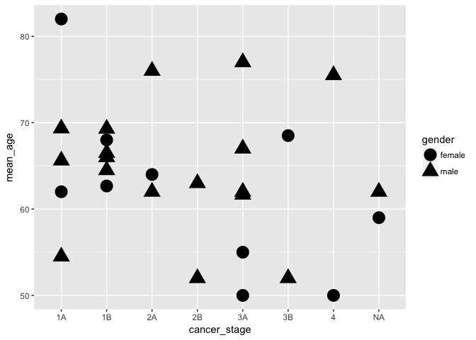

Analysis Report 2: The effects of lung adenocarcinoma on younger patients
================
Chelsea Noack
November 17, 2017

Introduction
============

Smoking is a common habit with dire consequences. Evidence of smoking's effects became evident beginning as early as the 1930's. Since then, it is common knowledge. Not all lung cancers are the same. For example, non small cell lung adenocarcinoma (NSCLC) accounts for 85% of lung cancers. Of those who have NSCLC, only about 15% survive five years post-diagnosis (Ettinger *et al.*, 2010). Thus, not only does lung cancer have a deadly consequence, but it is the most fatal.

But one component of lung cancer still leaves us worried. While the cancer is preventable by not having a tobacco habit, there is still a genetic component. In other words, even those who have never smoked can still get non small cell lung adenocarcinoma. Of the known carcinogens in cigarettes, they convert to reactive metabolites. When inactivated, they bind to cellular DNA and form adducts. Adduct are products of added molecules to create a distinct molecular species (Zienolddiny *et al.*, 2005). Large adducts typically get repaired. However, researchers find that not only cancer patients have low DNA repair capacity. Zienolddiny et al. state that "variant DNA repair genotypes may alter susceptibility to lung cancer" (2005). This indicates a genetic component within the repair mechanism. Some genotypes make people more susceptible to lung cancer despite habits (2005).

Many questions arise if we look into the genetic component of lung adenocarcinoma. For example, do females and males differ in this genetic component? Sex and gender cause many differences... can this difference also be cancer susceptibility? Can someone's inheritance and sex carry on genes influencing DNA repair pathways? Will the age of certain females and males factor into which stage of lung cancer they get diagnosed? Is it primarily older non-smoker females/males with severe cases of lung cancer? Or, less predictably, do younger, non-smokers have accelerated stages of cancer?

Any answer must take into account geographical and societal factors. In some countries, smoking is less approved than others. Also in some countries, society expects women to smoke less than men. To answer these questions, I will have to look at data from one area. In this case, Korea. Korea has many cancers besides lung such as stomach, colon/rectal, and thyroid. All cancers are prevalent in both sexes. However, lung cancer is still the most deadly. Lung cancer accounts for 15,623 deaths in 2010 (Jung *et al.*, 2013). Because lung cancer is also the most fatal in Korea, my analysis can shed light on a broad, global understanding.

I will use data from studies done by Seo et al. (2012) and Li et al. (2015) to better connect sex to the genetic components of lung cancer. In addition, I will attempt to understand genetics linked cancer severity for non-smokers. I hypothesize that younger, female non-smokers will have earlier/treatable cancer stages. Older, smoker males will have higher later stage cancers. Also, females will have a higher genetic component than men. The results of the study could indicate an important shift of understanding NSCLC. Once the genetic component is better analyzed, future generations can benefit. Thus, decreasing the death rates by lung cancer amongst the human, global population.

Methods
=======

Sample origin and sequencing
----------------------------

Seo et al. took fresh surgical samples of normal and cancerous tissues from 200 Korean patients. The patients had primary lung adenocarcinoma and recently underwent lung resection. They performed a transcriptional study between smokers and non-smokers. They took 68 of the 200 samples, normal and cancerous tissues from 34 smokers and 34 never-smokers. A category based on smoking habits categorized the patients; current, previously, or never. They also recorded gender, and cancer stage from the patients (Seo *et al.*, 2012).

They did transcriptome sequencing combine with whole-exome and transcriptome sequencing. Transcriptome sequencing has a past history of detecting somatic mutations in cancer. Their study the first large-scale study of lung cancer using RNAseq (Seo *et al.*, 2012).

Li et al. (2015) downloaded Seo et al.'s RNAseq data from GEO, the Gene Expression Omnibus. GEO is a database for high-throughput gene expression data. In doing so, they could perform a comprehensive pair-wise comparison analysis. From the data, they had 14 billion paired-end sequence reads ranging to 101 bp in length (Li *et al.*, 2015). Next, they confirmed a paired-nature of the RNA-seq data of normal vs. tumor tissue. Once confirmed, they used Ensembl GRCh37 Tophat to align the reads to the human genome. To count the reads by genes, they used HTSeq (Li *et al.*, 2015). For the differential gene expression analysis, they used R Bioconductor edgeR. Finally, Li et al. had to filter the data. They included genes with 1 count per million (cpm) in at least half the sample size. From there, we took their edited and filtered data for our analysis.

Computational
-------------

First, Dr. Napauka Zimmerman downloaded the files (ERP001058), which came from the NCBI Sequence Read archive. BioMartr made it easier to download the large amounts of data. Biomartr is a package in CRAN. It retrieves metagenomic data and functional annotation retrieval. It is more polished than NCBI.

Next, the files converted from SRA to fastq. Because the files were so massive, Zimmerman had to use Sailfish. Sailfish is a package which quantifies the amount of already annotated RNA isoforms from RNA-seq data. In doing so, it avoids mapping reads (Patro *et al.*, 2014). This makes Sailfish 20 times faster than alternative methods, while maintaining accuracy. This is ideal for processing large amounts of sequencing reads.

Zimmerman processed the files. Then, the files were quality checked. FastQC is a quality checking program which eliminates low quality reads. QC reports are helpful to see how viable each sequence is for analysis. If the majority of the sequence is above a 30 score, then it's sequenced well. Typically, the 3' end will deteriorate, which is normal.

The next step was to put the files through paired-end Trimmomatic. Trimmomatic clipped off Illumina adapters and reads with quality scores less than 20. Once trimmed, Zimmerman aligned the sequences using Sailfish. Sailfish aligns sequences using k-mers. As mentioned before, Sailfish is fast. The program parsed each sample. 88 cores were used in an overnight run in order to perform the alignment. Finally, with parsed sequences aligned, Zimmerman built the tables. Within our table, each row is a human gene name and the column is different samples in all the groups. Zimmerman "melted" the table so it included the metadata and original data. Dplyr and ggplot help us analyze the data from the melted tables.

Results
=======

| cancer\_stage | gender |  mean\_age|
|:--------------|:-------|----------:|
| 4             | male   |   75.50000|
| 2A            | male   |   69.00000|
| 3B            | female |   68.50000|
| 1B            | male   |   68.06667|
| 3A            | male   |   66.33333|
| 2A            | female |   64.00000|
| 1A            | male   |   63.95000|
| 1A            | female |   63.25000|
| 1B            | female |   63.20000|
| NA            | male   |   62.00000|
| NA            | female |   59.00000|
| 2B            | male   |   57.50000|
| 3A            | female |   52.50000|
| 3B            | male   |   52.00000|
| 4             | female |   50.00000|

**Table 1**: A table of the mean ages for the different categories of cancer stages and gender. The eldest, 75 years old, typically will be a male with stage 4 cancer. The youngest (although not the youngest of all metadata) is 50 years old females with stage 4.

**Figure 1**: A figure showing the abundance of cancer stages against mean ages. We see stage 4 cancer most prevalent in males above 75 years old and in females about 50 years old.

| smoking\_status | gender | cancer\_stage |  mean\_age|
|:----------------|:-------|:--------------|----------:|
| previously      | female | 1A            |   82.00000|
| previously      | male   | 3A            |   77.00000|
| previously      | male   | 2A            |   76.00000|
| previously      | male   | 4             |   75.50000|
| never           | male   | 1A            |   69.33333|
| previously      | male   | 1B            |   69.30000|
| never           | female | 3B            |   68.50000|
| previously      | female | 1B            |   68.00000|
| unknown         | male   | 3A            |   67.00000|
| current         | male   | 1B            |   66.50000|
| unknown         | male   | 1B            |   66.00000|
| previously      | male   | 1A            |   65.61538|
| never           | male   | 1B            |   64.50000|
| never           | female | 2A            |   64.00000|
| previously      | male   | 2B            |   63.00000|
| never           | female | 1B            |   62.66667|
| current         | male   | 2A            |   62.00000|
| never           | female | 1A            |   62.00000|
| never           | male   | 3A            |   62.00000|
| unknown         | male   | NA            |   62.00000|
| current         | male   | 3A            |   61.66667|
| never           | female | NA            |   59.00000|
| previously      | female | 3A            |   55.00000|
| current         | male   | 1A            |   54.50000|
| current         | male   | 2B            |   52.00000|
| never           | male   | 3B            |   52.00000|
| current         | female | 3A            |   50.00000|
| never           | female | 4             |   50.00000|

**Table 2**: A more detailed table indicating smoking status of the average oldest and youngest females within the scope of the metadata.

**Figure 2**: A figure to visualize smoking status between females and males based on average ages.

**Figure 3**: The figure shows the abundance of females and males within certain cancer stages and mean ages. The clustering effect makes it visually better to understand than other figures.

| gender | genename |  mean\_count|
|:-------|:---------|------------:|
| male   | EEF1A1   |    183911.87|
| female | EEF1A1   |    149021.94|
| female | SFTPB    |    135305.42|
| male   | SFTPB    |    105009.56|
| male   | MIR6723  |     91501.45|
| male   | FTL      |     77787.92|
| male   | RNA28S5  |     71265.16|
| female | SFTPA2   |     66520.77|
| male   | FN1      |     65454.33|
| male   | CD74     |     63047.61|
| male   | SFTPA2   |     60627.62|
| female | CD74     |     58994.05|
| female | MIR6723  |     58916.57|
| female | RNA28S5  |     58079.55|
| male   | FTH1     |     52390.78|

**Table 3**: A table with the top 15 genes found within the data's sampling of females and males.

**Figure 4**: The figure shows the amount of the top 15 genes within the meta data of women and males correlated to smoking status and age of diagnosis.

**Figure 5**: The figure shows the top 15 genes sorted by the sex/gender and mean count of the genes.

Discussion
==========

**Findings**:

My analysis of the correlation between sex/gender and cancer proclivity, using the Seo et al. and Li et al. data, shows results opposite of my hypothesis.

We see from the data that a more young, female patients have later stage lung cancer. Older female patients have early stage lung cancer. Odd. Yet, younger males had early stage lung cancers and older males had late stage lung cancer. Both females and males were similar for stages 1A, 1B and 2A (Figure 1).

First, the findings with the males makes sense, as it goes along with my hypothesis. I claimed that as you get older, the more likely you are to have later stage lung cancer than younger people. Uncontrolled cell growth and poor repair mechanisms increase as you age. The process is a basic consequence of senescence. We see in the data set that the oldest males having stage 4 lung cancer (Table 1, Figure 1). But we do not see this pattern all across for males.

In fact, we see the average 69 year old male has stage 2A and 68 year old male has stage 1B. We predict that males in stage 3B would be the eldest, but in fact they were the lowest mean age, 52 years old (Table 1). Females face the same issue, except for stage 4. Thus, it's important to look at smoking status.

Table 2 shows that for the young female Korean patients whom had stage 4 claim to never smoke. It would be far too simple to argue that it's based on sampling bias. Rather, this is a crucial part of my analysis which will developed later. The youngest males with stage 3B cancer also claim to never smoke (Table 2). Interesting. We see a clear connection between never smoking and higher stages of lung cancer in young patients.

Noteably, in the accompanying Figure 2, we see females and males are similar in age for never smokers. This could be due to the sampling within the hospital.. regardless, the statistic is strange. In Figure 3, a more distinct cluster of both males and females around the same age are within similar cancer stages. The similar stages are 1B, N/A (differing from the N/A smoking status category), and 2A (Figure 3). We see the most drastic differences in mean age and cancer stage at, again, stage 4 and 3B. 1A also has variance between men and women, but not as significantly.

We see from my analysis that being young does not mean you are exempt from later stage lung cancer. This leads me to ask which genes are responsible for the trend, which isn't an easy undertaking. In Figure 4, we attempt to find genes more common in certain age groups. However, we see that throughout most ages, all genes are playing a part. For never smokers, we see a smaller range than current smokers. We also see a slight skew to the left, identifying more outliers within the younger age groups. This does not help our analysis. If anything, the skew proposes new questions which need further research. Figure 4 does help us identify that most genes occur in lung cancer patients around 60-70 years old.

Lastly, in Figure 5 we see a strange occurrence of three genes only in males. The genes are FN1, FTH1, and FTL. FN1 gene encodes for a heavy weight glycoprotein. It is crucial for the metastasis of melanoma cells (Ridley, 2000). FTH1 gene encodes for an iron storage factor. represses ferritin-H expression. Its up-regulation stimulates apoptosis triggered by the tumor necrosis factor (TNF) (Pham *et al.*, 2004). Phenotypes resulting from the FTL gene depends on where its mutation is. The gene most connected with iron regulation and cellular function (Sammarco *et al.*, 2008).

Two genes found here might influence cancer, but I'm apprehensive to use these findings. Genes, generally, are in many processes. These genes might be indicative of male cancer patients, but they also might be indicative of general Korean male health. Thus, while the findings are interesting, I will not develop them further here.

**Conclusion**:

Symptoms are more clear in later stage cancer. This could be the reason we see more people with later stage despite age difference. The genetic component might be stronger, or as strong, as the environmental component.

In a twin study done by Ahlbom et al., smoking and genetics were not completely distinct (1997). The habit of smoking often affects familial patterns of lung cancer in twins. The large amount of nonsmoker females with lung cancer indicates another worry. That is that women are getting secondhand smoke from their partners. In Korea, Jee et al. found that the rate of lung cancer is non smoking women was higher if their husbands smoked. This was due to its secondhand nature (1999). The results are jarring. We cannot say this is the answer, but we need more genetic and anthropological studies.

The findings found from more research could end up benefitting people around the world with lung cancer. The power of secondhand smoke, from the data, appears to be immense. Equally immense appears to be the genetic component of passing on carcinogens to your offspring. The knowledge found here and in similar studies has the propensity to save future lives.

Sources Cited
=============

Ettinger,D.S. *et al.* (2010) Non–small cell lung cancer. *Journal of the national comprehensive cancer network*, **8**, 740–801.

Jung,K.-W. *et al.* (2013) Cancer statistics in korea: Incidence, mortality, survival and prevalence in 2010. *Cancer research and treatment: official journal of Korean Cancer Association*, **45**, 1.

Li,Y. *et al.* (2015) RNA-seq analysis of lung adenocarcinomas reveals different gene expression profiles between smoking and nonsmoking patients. *Tumor Biology*, **36**, 8993–9003.

Patro,R. *et al.* (2014) Sailfish enables alignment-free isoform quantification from rna-seq reads using lightweight algorithms. *Nature biotechnology*, **32**, 462–464.

Pham,C.G. *et al.* (2004) Ferritin heavy chain upregulation by nf-*κ*b inhibits tnf*α*-induced apoptosis by suppressing reactive oxygen species. *Cell*, **119**, 529–542.

Ridley,A. (2000) Cancer: Molecular switches in metastasis. *Nature*, **406**, 466–467.

Sammarco,M.C. *et al.* (2008) Ferritin l and h subunits are differentially regulated on a post-transcriptional level. *Journal of Biological Chemistry*, **283**, 4578–4587.

Seo,J.-S. *et al.* (2012) The transcriptional landscape and mutational profile of lung adenocarcinoma. *Genome research*, **22**, 2109–2119.

Zienolddiny,S. *et al.* (2005) Polymorphisms of dna repair genes and risk of non-small cell lung cancer. *Carcinogenesis*, **27**, 560–567.
